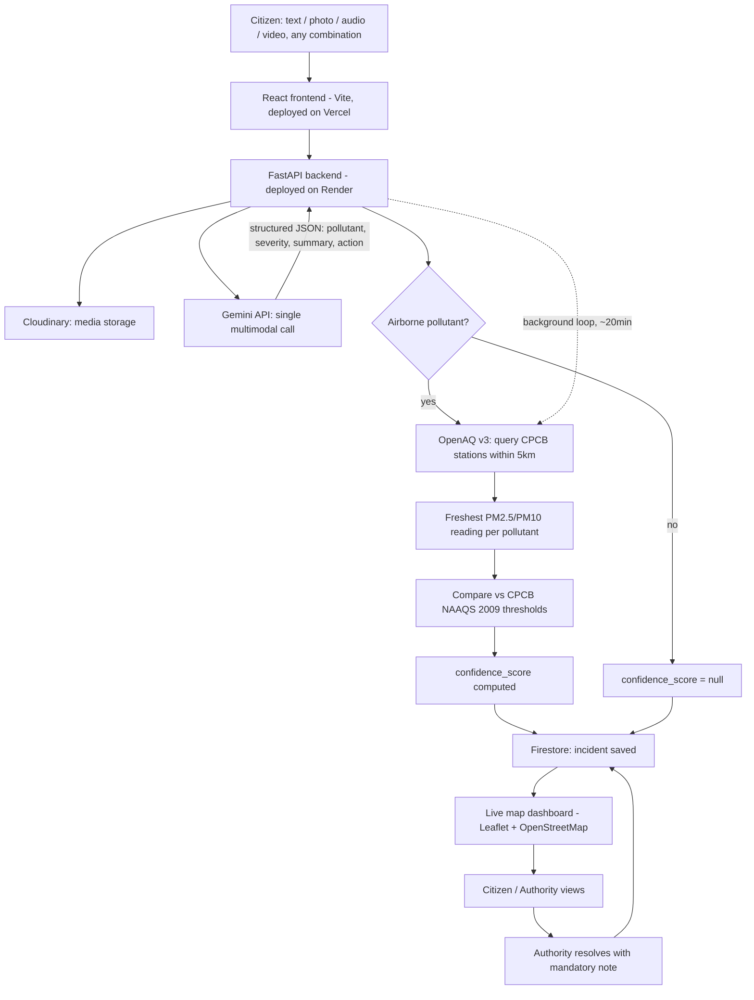

# PrakritiPrahari — Project Write-up

**Build with AI: Code for Communities — Track 02: Environment (CleanAir & Clear Streets)**
**Team:** Kavitha Haima Kidambi (solo)

---

## 1. The Problem

City-wide AQI applications report averages across an entire municipality. That averaging is exactly what makes them blind to the incidents that actually hurt people at street level: a garbage-dump fire two streets away, an isolated industrial cluster, a smog trap at one busy intersection, illegal dumping in a specific lot. Municipal authorities have no granular visibility into these hyper-local pockets, because the only instrumentation they have is a handful of fixed monitoring stations spread across an entire city — nowhere near dense enough to catch a localized incident as it happens. Residents living near these unmonitored pockets are the ones directly affected, and there is currently no low-friction way for them to report what they're seeing/smelling/breathing in a way that gets routed anywhere useful, fast.

## 2. Our Exact Solution

PrakritiPrahari is a citizen-reporting and mapping platform that closes that gap in two ways at once: it lowers the friction of reporting to near-zero, and it grounds every report against real government sensor data instead of trusting the citizen report in isolation.

**Reporting side:** A citizen submits a report in *any* combination of text, photo, audio, or video — not fixed form fields, a dynamic list of whatever they actually have on hand — in any of 13 Indian languages, plus a location (GPS or searched address). That entire multimodal bundle goes to Gemini in a single API call. Gemini transcribes and translates native-language audio/text, reads visual hazard context out of photos/video, and returns structured JSON: pollutant type, a 1–5 severity score, a plain-English summary, and a recommended action. No separate speech-to-text pipeline per language, no separate image-classification model — one model call handles the full multimodal bundle natively.

**Verification side:** This is the part that separates PrakritiPrahari from a report-and-hope app. For airborne-pollutant incidents (smoke, dust, burning), the backend queries OpenAQ v3 for live CPCB government sensor stations within a 5km radius of the reported location, pulls the freshest PM2.5/PM10 reading per pollutant, and compares it against the official CPCB NAAQS 2009 24-hour thresholds (PM2.5: 60 µg/m³, PM10: 100 µg/m³). If a nearby station is also reading elevated levels, the report's `confidence_score` goes up — this is a citizen report corroborated by an independent government sensor, not just a single unverified claim. Beyond 5km, we don't force a comparison; confidence stays `null` with an internal reason logged, because a station that far away isn't making a meaningful claim about a hyper-local incident.

**Output side:** Every report — citizen or sensor-sourced — lands on a live map (Leaflet/OpenStreetMap) visible to both citizens and authority accounts, color-coded by severity, with sensor pins visually distinct from citizen pins. Authority accounts can resolve incidents with a mandatory resolution note, closing the loop from report to municipal action.

## 3. Datasets & Tools

| Source | What it is | How we use it |
|---|---|---|
| **Gemini API** (Google AI Studio) | Google's multimodal foundation model | Single-call processing of mixed text/photo/audio/video reports — transcription, translation (11 languages), visual hazard analysis, severity scoring, structured JSON output |
| **OpenAQ v3** | Open-data aggregator ingesting real-time CPCB/SPCB station data directly (`provider.name: "CPCB"` confirmed per station) | Point+radius geospatial query (5km) for nearby live government sensors, freshest-reading-per-pollutant cross-verification for `confidence_score` |
| **CPCB NAAQS 2009** | Official gazetted 24-hour air quality thresholds (PM2.5: 60 µg/m³, PM10: 100 µg/m³) | Baseline against which OpenAQ sensor readings are compared to determine if a location is having a genuinely bad air day |
| **Firebase Firestore** | Google's NoSQL document database | Primary datastore for all incident records |
| **Firebase Authentication** | Google's auth service | Anonymous sessions for zero-friction citizen reporting; email/password + custom claims for authority accounts |
| **Cloudinary** | Media storage/CDN | Permanent storage of uploaded photo/audio/video evidence |
| **OpenStreetMap + Nominatim** | Open map data and geocoding | Map tiles for the dashboard; reverse-geocoding GPS to address; forward address search for manual location entry |

**Why OpenAQ over `data.gov.in` directly:** we tested both live. `data.gov.in`'s real-time AQI resource returns station *names* with no lat/lng, which would've required reverse-geocoding every station name through a separate service just to compute distance. OpenAQ v3 ingests the same underlying CPCB station data but exposes a native point+radius query with server-side distance calculation — same official government source, a cleaner integration path.

## 4. System Architecture

**Flow summary:** citizen submits → frontend sends to backend → backend stores media in Cloudinary and sends the full multimodal bundle to Gemini in one call → Gemini returns structured classification → if the pollutant is airborne, backend independently queries OpenAQ for nearby live CPCB sensor data and computes a corroboration-based confidence score → everything saves to Firestore → map dashboard reflects it in real time → authority accounts close the loop by resolving with a note. A background loop re-pulls sensor data every ~20 minutes independent of citizen reports, so sensor pins stay live rather than freezing at whatever they were on last deploy.

## 5. Future Scope & Technical Roadmap

- **Full gas pollutant coverage (NO2, CO, O3).** Currently, cross-verification runs on PM2.5/PM10 only, since these come back from live OpenAQ sensors in `µg/m³` — directly comparable to CPCB NAAQS thresholds — while gas pollutants report in `ppb` on the currently-active sensors. The path to closing this: apply the standard ppb-to-µg/m³ conversion (concentration × molecular weight ÷ molar volume at reference temperature/pressure) per pollutant before comparison, which is a well-defined unit conversion rather than an open research problem — a clear next build increment.

- **Calibrated confidence scoring.** The confidence-score deltas applied on corroborated vs. uncorroborated reports are currently a reasoned heuristic layered on top of real CPCB NAAQS thresholds. As the platform accumulates a track record of resolved incidents, those outcomes become labeled ground truth — enough volume there would let the delta values be replaced with a calibrated model (e.g. a lightweight logistic regression over corroboration signal, distance, and time-to-resolution) instead of fixed heuristic values.

- **Persistent citizen identity across devices.** Citizen sessions currently use Firebase's anonymous auth, tied to browser + device by design, to keep reporting frictionless with zero signup. The natural next step is Firebase's built-in anonymous-to-permanent account linking (`linkWithCredential`) — a citizen could optionally link a phone number or email at any point without losing their existing report history or starting a new signup flow, giving cross-device persistence without sacrificing the current zero-friction entry point.

- **Role-based access, jurisdiction routing, and engagement features.** These three build on each other and on the account-linking step above: once persistent accounts exist, Firebase custom claims can scope authority accounts to a jurisdiction (so a Delhi officer sees Delhi incidents by default, with an opt-in nationwide toggle for citizens), Firestore security rules can enforce that scoping server-side rather than in the client, and a points/recognition layer can trigger automatically off the same corroboration event that already computes `confidence_score` today — no new detection logic needed, just a rewards layer on top of a signal the system already produces.

## 6. Impact

Municipal dispatch teams currently have no way to know about a localized incident until it's escalated manually or shows up as a citywide average trend days later. PrakritiPrahari gives them a live, government-data-corroborated map of exactly where a problem is happening right now, with enough context (severity, recommended action, media evidence) to prioritize a response — cleanup crews, water-mist cannons, or further investigation — without waiting for a citywide sensor network that doesn't exist yet and won't for years. For residents, it means a five-second multimodal report in their own language actually reaches someone, instead of disappearing into a general grievance portal with no pollution-specific routing.